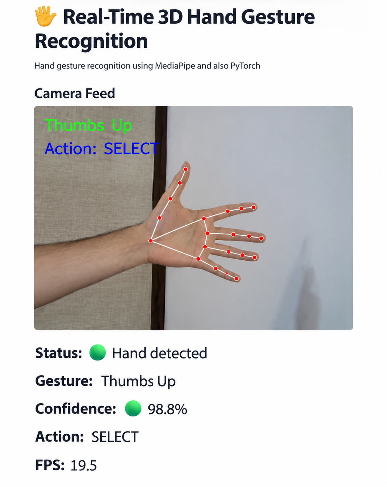
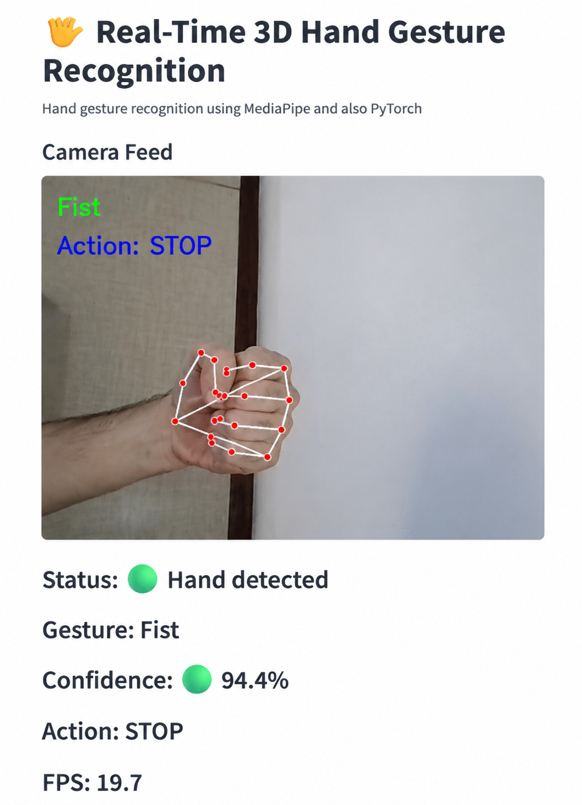
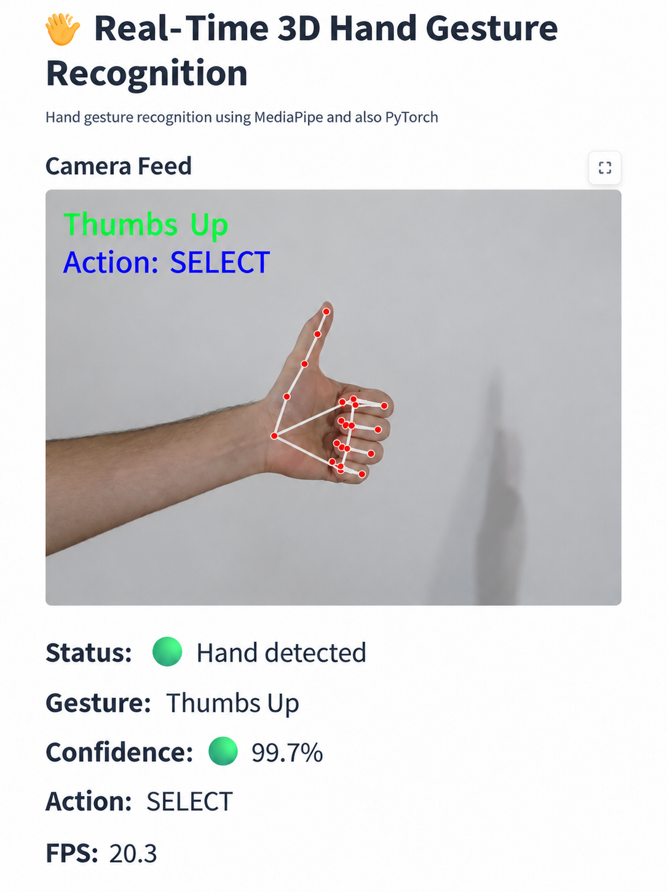

# Real-Time 3D Hand Gesture Recognition

A real-time 3D hand gesture recognition system using **MediaPipe Hands**, 
**PyTorch**, **OpenCV**, and **Streamlit**.

## Overview

This project implements a vision-based **Human-Computer Interaction (HCI)**
system for real-time hand gesture recognition using webcam input.

The system extracts 3D hand landmarks using MediaPipe Hands and classifies
gestures using a lightweight PyTorch neural network. A Streamlit interface
provides real-time visualization of the camera feed, detected gesture,
confidence score, and control command.

## Supported Gestures

| Gesture | Command |
|---|---|
| Open Hand | START |
| Fist | STOP |
| Thumbs Up | SELECT |

## System Pipeline

1. Webcam input
2. 3D hand landmark extraction (MediaPipe Hands)
3. Feature extraction
4. Neural network classification (PyTorch)
5. Real-time visualization (Streamlit)

## Model Architecture


- Input: 65-dimensional feature vector
- Output: 3 gesture classes

## Results

The trained model achieved approximately:

**93% accuracy**

Evaluation:
- Confusion Matrix
- Classification Report

## Demo

<p align="center">

</p>

### Gesture Examples

<p align="center">



</p>

## Technologies

- Python
- PyTorch
- MediaPipe Hands
- OpenCV
- Streamlit
- NumPy
- Scikit-learn

## Project Structure

```
Real-Time-3D-Hand-Gesture-Recognition/

├── train.py
├── evaluation.py
├── feature_extraction.py
├── gesture_features.py
├── streamlit_gesture_app.py
├── gesture_model.pth
├── gesture_data.csv
├── gesture_features_dataset.csv
├── normalized_gesture_data.csv
├── requirements.txt
├── Report.pdf
└── README.md
```

## Installation

Install the required dependencies:

```bash
pip install -r requirements.txt
```

## Running the Application

Run the Streamlit interface:

```bash
streamlit run streamlit_gesture_app.py
```

## Report

The complete project report is available here:

[Project Report (PDF)](Report.pdf)

## Author

**Soheil Hemmat**
