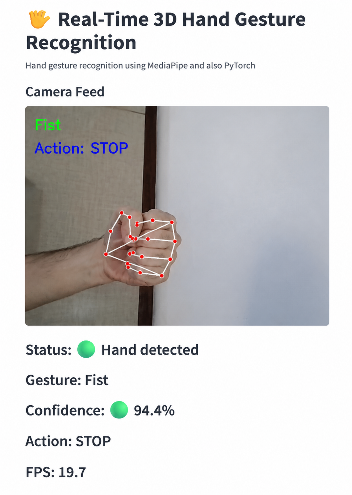

# Real-Time 3D Hand Gesture Recognition

A real-time 3D hand gesture recognition system using **MediaPipe Hands**, 
**PyTorch**, **OpenCV**, and **Streamlit**.

## Overview

This project implements a vision-based **Human-Computer Interaction (HCI)**
system that recognizes hand gestures from webcam input in real time.

Instead of processing raw images directly, the system extracts 3D hand
landmarks using MediaPipe Hands. The extracted landmark coordinates are
converted into numerical feature vectors and classified using a lightweight
PyTorch neural network.

The final application provides real-time gesture recognition with a
Streamlit-based interface displaying the camera feed, detected gesture,
confidence score, and corresponding command.

## Features

- Real-time hand detection from webcam input
- 3D hand landmark extraction using MediaPipe Hands
- Geometric feature extraction from hand landmarks
- Neural network-based gesture classification
- Confidence score estimation
- Real-time visualization using Streamlit

## Supported Gestures

The system recognizes three predefined gestures:

| Gesture | Command |
|---|---|
| Open Hand | START |
| Fist | STOP |
| Thumbs Up | SELECT |

## System Pipeline

The complete processing pipeline consists of:

1. Capture video frames from webcam
2. Detect hand landmarks using MediaPipe Hands
3. Extract numerical features from landmarks
4. Classify gestures using PyTorch neural network
5. Display recognition results through Streamlit interface

## Model Architecture

The gesture classifier is a lightweight fully connected neural network.

```
Input (65 features)
        |
      128
        |
      ReLU
        |
       64
        |
      ReLU
        |
Output (3 classes)
```

The network structure:

```
65 → 128 → 64 → 3
```

## Feature Representation

Each detected hand is represented using:

- 21 MediaPipe hand landmarks
- 3D coordinates (x, y, z)

Initial features:

```
21 × 3 = 63 features
```

Additional geometric features:

- Thumb tip to thumb base distance
- Thumb tip to thumb joint distance

Final feature vector:

```
63 + 2 = 65 features
```

## Results

The trained model achieved approximately:

**93% accuracy**

The model was evaluated using:

- Confusion Matrix
- Classification Report
- Accuracy measurement

## Demo

The system runs in real time using a webcam and provides gesture
classification through a Streamlit interface.



## Technologies

- Python
- PyTorch
- MediaPipe Hands
- OpenCV
- Streamlit
- NumPy
- Scikit-learn
- LaTeX

## Project Structure

```
Real-Time-3D-Hand-Gesture-Recognition/

├── train.py
├── evaluation.py
├── feature_extraction.py
├── gesture_features.py
├── streamlit_gesture_app.py
├── gesture_model.pth
├── gesture_data.csv
├── gesture_features_dataset.csv
├── normalized_gesture_data.csv
├── requirements.txt
├── Report.pdf
└── README.md
```

## Installation

Install the required dependencies:

```bash
pip install -r requirements.txt
```

## Running the Application

Run the Streamlit interface:

```bash
streamlit run streamlit_gesture_app.py
```

## Report

The complete project report is available here:

[Project Report (PDF)](Report.pdf)

## Author

**Soheil Hemmat**
